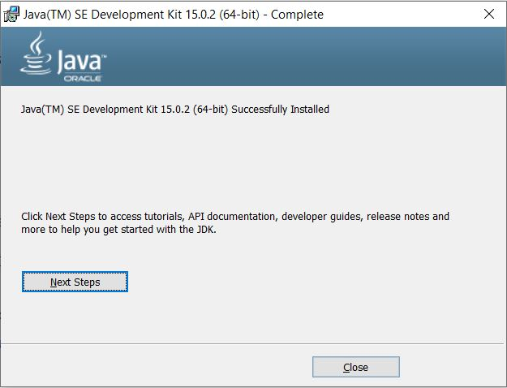
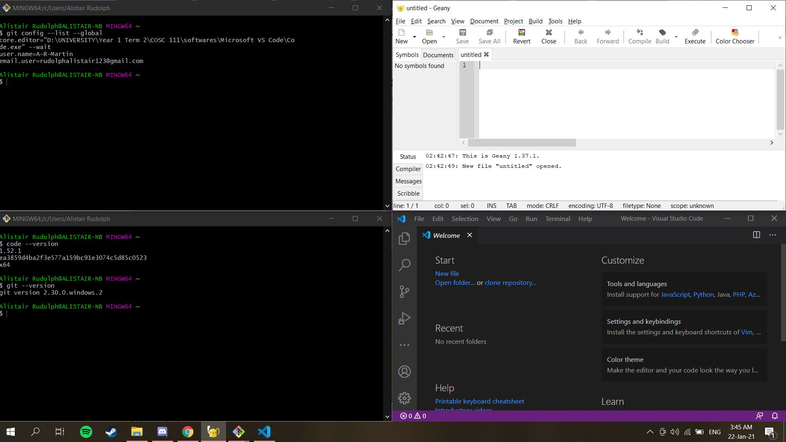
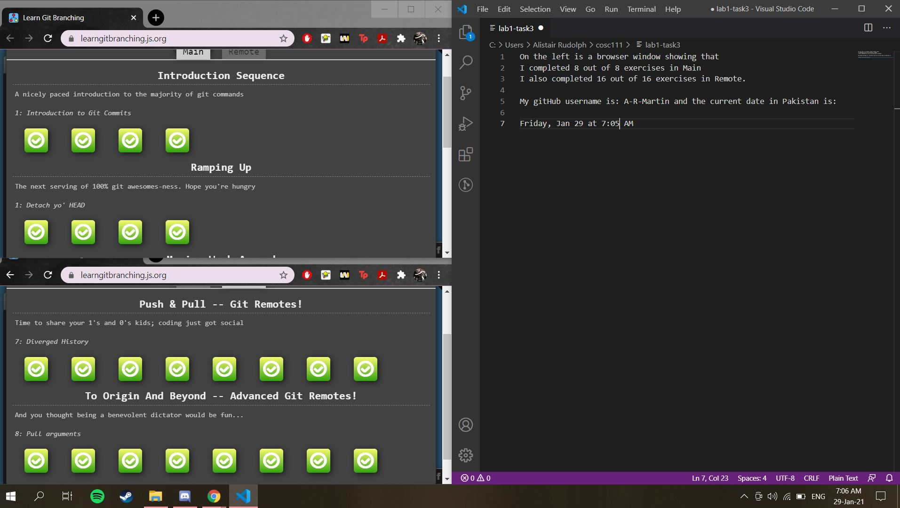

# Lab 1

This week, you will include all of your "answers" to this week's lab in this README file, 

## Task 1: Install the Java JDK (12 marks)

For this task, please include a screenshot as described in the [Lab 1](./lab1.md) file.

## Task 2: Prepare your System (40 marks)

For this task, please include a screenshot as described in the [Lab 1](./lab1.md) file.

## Task 3: GitHub Tutorial (48 marks)

For this task, please include a screenshot as described in the [Lab 1](./lab1.md) file.

